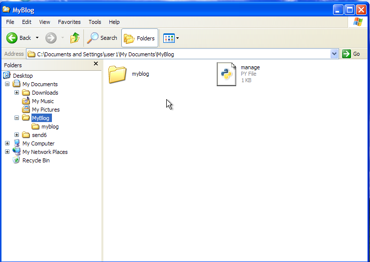
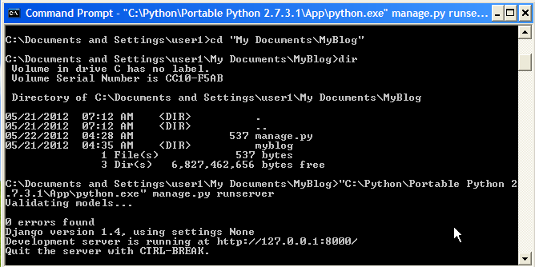
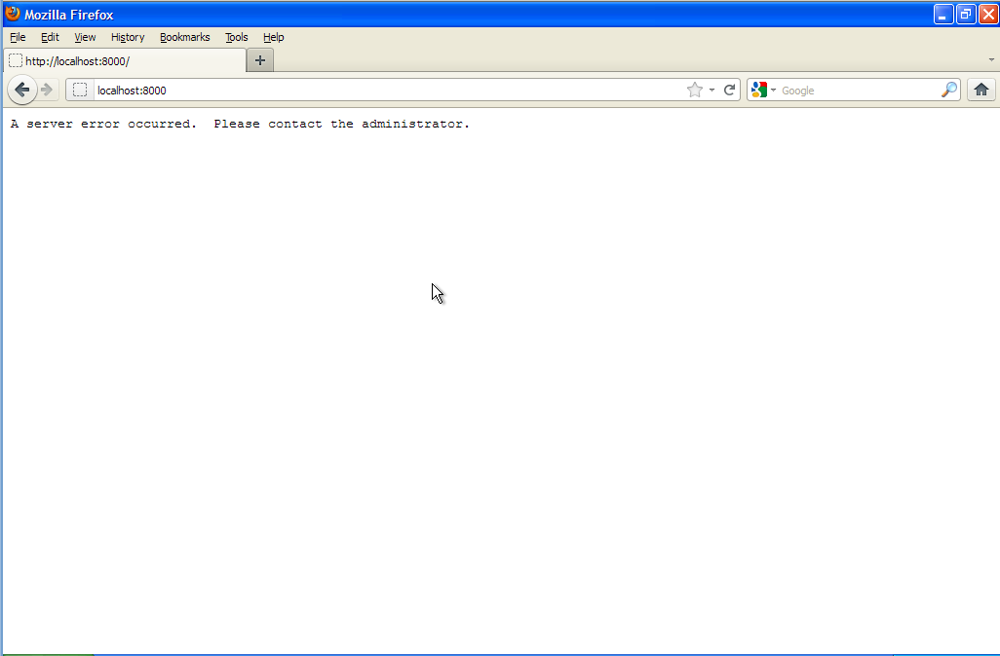
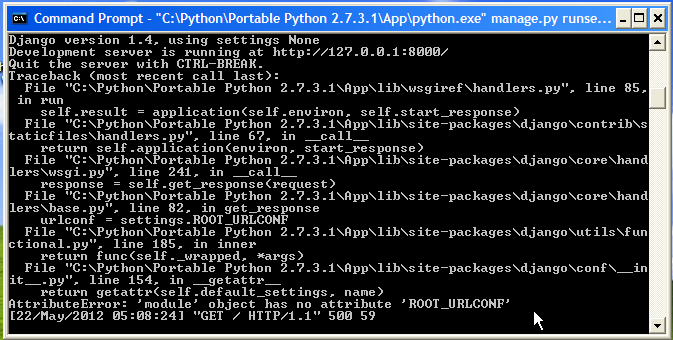
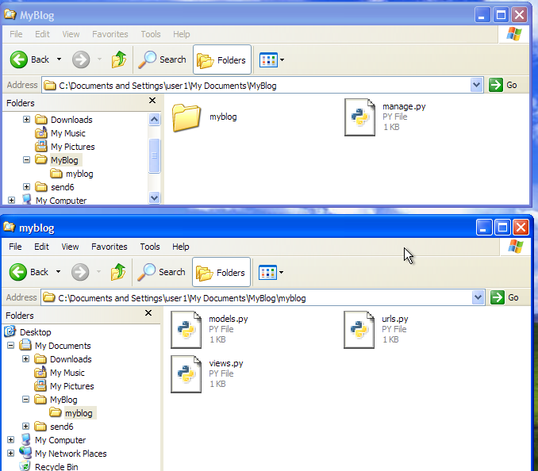
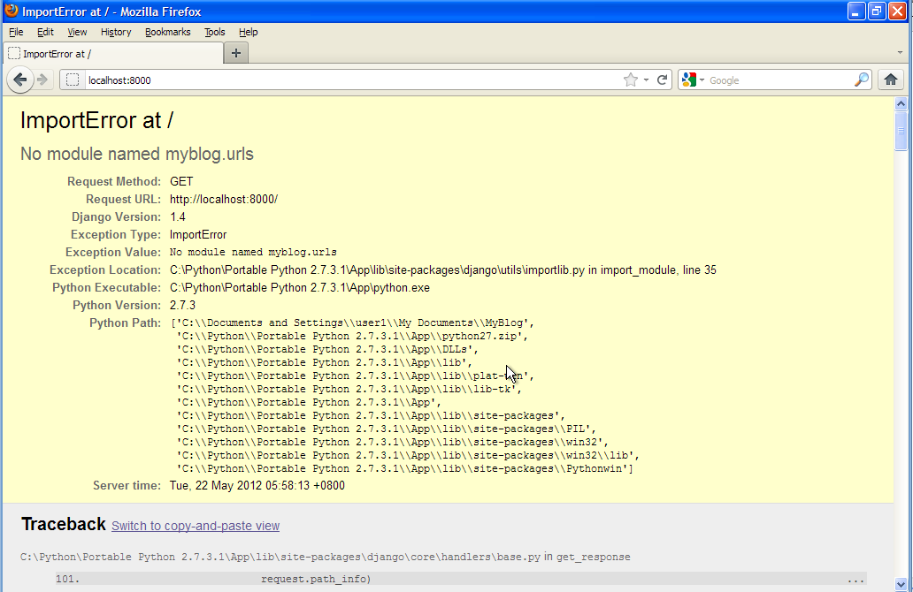
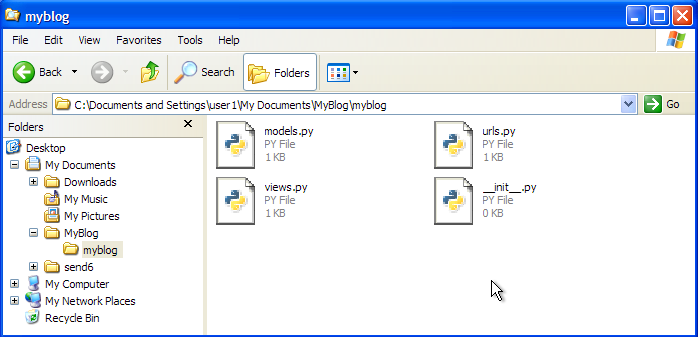
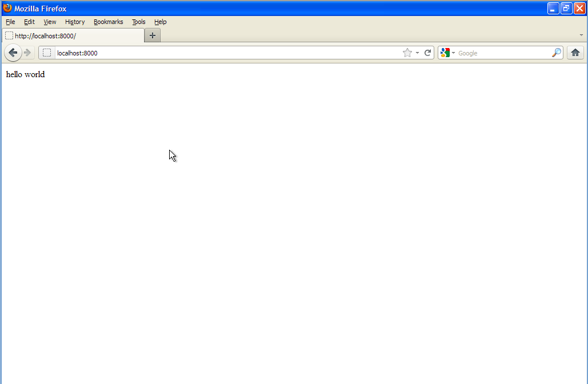

Aplikasi Asas
=============
Dalam bahagian ini, kita akan mula membina struktur asas sebuah aplikasi berasaskan
Django. Kita akan mencuba melancarkan aplikasi Django yang boleh diakses melalui
pelayar web menggunakan alamat - http://localhost:8000/ dan ia akan memaparkan
teks "Selamat Datang !".

.. note:: Pendekatan yang digunakan dalam panduan ini sedikit berlainan daripada
   yang digunakan oleh tutorial FIXME::rasmi daripada project Django_ di mana
   mereka menggunakan skrip ``django-admin.py`` untuk *generate* struktur asas
   aplikasi. Penulis bagaimanapun berpendapat struktur yang dijana oleh
   ``django-admin.py`` mengandungi terlalu banyak kod yang boleh menganggu proses
   pemahaman mereka yang baru hendak bermula. 

Kita namakan projek Django_ pertama ini sebagai **MyBlog**. Projek ini kita
tempatkan dalam folder ``My Documents\MyBlog`` jadi mulakan dengan membuat
direktori tersebut dalam folder ``My Documents`` anda. Hasil akhir perlu kelihatan
seperti berikut:-

Di sini anda dapat lihat saya telah membuat satu lagi folder yang dinamakan
``myblog`` dan satu fail yang dinamakan ``manage.py``.

.. note:: Konfigur *Windows Explorer* anda untuk memaparkan *extension* bagi
   setiap fail. Dalam Windows XP, ia boleh dilakukan melalui
   ``Tools -> Folder Options -> View -> Advance Settings``.

Mari saya terangkan apakah kegunaan fail-fail dan folder ini secara ringkas:-

* ``myblog`` - Folder ini merupakan *package* dalam Python_. Di sinilah kebanyakkan daripada kod-kod aplikasi akan ditempatkan. Dalam kod Python_ anda akan merujuk kepada *package* ini melalui *import statement* seperti::

    import myblog

* ``manage.py`` - Ini adalah *launcher* kepada aplikasi kita. Dalam Django_ ia dikenali sebagai *management script* kerana selain untuk *execute* aplikasi, ia juga digunakan untuk tugas-tugas seperti *generate database tables*, *copy files* dan lain-lain.

Folder ``MyBlog`` yang mengandungi fail-fail serta folder ini pula boleh dianggap sebagai folder projek kerana ia akan turut mengandungi fail-fail selain kod sumber
seperti dokumentasi, *README*, skrip-skrip pembantu (*helpers script*) dan sebagainya.

===============
Lancar Aplikasi
===============
Saat yang ditunggu-tunggu setelah anda bersusah payah untuk memasang dan konfigur Python sehingga berjaya. Kita mulakan dengan menulis kod untuk fail ``manage.py``. Saya menggunakan aplikasi `Notepad++`_ untuk mengedit kod dalam panduan ini. Anda boleh juga menggunakan aplikasi notepad atau apa-apa sahaja yang serasi.

Taip kod berikut dalam fail ``manage.py`` anda::

    from django.conf import settings
    from django.core.management import execute_from_command_line

    settings.configure(DEBUG=True)
    execute_from_command_line()

Untuk melancarkan kod yang baru kita tulis ini, kita perlu menggunakan *Python interpreter* yang didatangkan bersama dengan aplikasi PortablePython yang kita *install* dalam bahagian sebelum ini. Anda perlu menggunakan Windows Command Prompt untuk ini. Bukan Command Prompt, jika menggunakan Windows XP ianya adalah melalui butang ``Start -> All Programs -> Accessories -> Command Prompt``. Seterusnya, taip baris arahan berikut::

    cd "MyDocuments\MyBlog"
    "C:\Python\Portable Python 2.7.3.1\app\python.exe" manage.py runserver

.. note:: Baris arahan di atas menganggap anda memasang aplikasi PortablePython ke folder ``C:\Python\Portable Python 2.7.3.1``. Jika anda memilih lokasi berlainan, sila betulkan *path* berkaitan.

Outputnya harus kelihatan seperti dalam cekupan skrin dibawah:-

Sekarang buka aplikasi browser anda (saya menggunakan FireFox di sini) dan cuba akses alamat berikut - http://localhost:8000. Browser anda akan memaparkan laman berikut:-

Ada *error* nampaknya. Jangan risau. Kod anda masih belum lengkap sepenuhnya jadi
ianya bukanlah memeranjatkan. Mari kita lihat dalam Windows Command Prompt jika ada sebarang output yang boleh membantu kita untuk *debug* masalah yang kita hadapi
sekarang.

Perhatikan pada bahagian bawah sekali, anda akan mendapat baris yang kelihatan seperti berikut::

    AttributeError: 'module' object has no attribute 'ROOT_URLCONF'

``ROOT_URLCONF`` adalah salah satu *settings* yang diperlukan oleh Django dan nampaknya kita tidak menyediakan *settings* tersebut. Buka semula fail ``manage.py`` menggunakan `Notepad++`_. Kita perlu membetulkan kod dalam fail ini supaya kelihatan seperti berikut::

    from django.conf import settings
    from django.core.management import execute_from_command_line

    settings.configure(DEBUG=True, ROOT_URLCONF='myblog.urls')
    execute_from_command_line()
    
.. note:: Kesemua *settings* yang Django perlukan kita akan *pass* sebagai
    *parameter* kepada *function* ``settings.configure()``. Sebenarnya ada
    2 cara untuk *pass* *settings* kepada Django tapi untuk sementara waktu
    mari kita gunakan cara ini sahaja. 

*Settings* ``ROOT_URLCONF`` adalah untuk memberitahu Django akan *path* kepada
*module* Python yang akan bertindak sebagai *router* dalam aplikasi kita.
*URL Routing* dalam sebuah web aplikasi berfungsi memadankan URL daripada browser
kepada *function* atau apa-apa bentuk *handler* dalam aplikasi kita. *Function*
atau *handler* ini kemudiannya bertangunggjawab untuk mengeluarkan output yang
akan dapat dipaparkan pada browser.

*Module* dalam Python adalah apa-apa fail yang mempunyai *extension* .py dan
mengandungi kod Python. Untuk itu, mari kita masukkan kod asas bagi *URL routing*
bagi aplikasi kita. Kod ini perlu dimasukkan ke fail ``myblog\urls.py``::

    from django.conf.url import patterns, url

    import myblog

    urlpatterns = patterns('',
        url(r'^$', myblog.views.index),
    )

Dalam kod di atas, kita ada merujuk kepada module ``myblog.views`` jadi untuk
melengkapkan kod di atas, kita sediakan juga kod untuk module ``myblog.views``
ke dalam fail ``myblog\views.py``::

    from django.http import HttpResponse

    def index(request):
        return HttpResponse('Selamat Datang !')

.. note:: Dalam Python, untuk merujuk kepada module dalam sesuatu kod, kita akan
    ganti *separator* untuk folder seperti \\ atau / dalam Unix/Linux kepada . (dot) dan buang *extension* .py. Contohnya untuk module ``myblog\views.py`` apabila
    dirujuk melalui kod akan menjadi ``myblog.views`` sahaja.

Hasil akhir, folder ``myblog`` kita akan mempunyai fail seperti berikut:-

Mari kita cuba lancarkan aplikasi ini sekali lagi. Seperti sebelum ini, taip
arahan berikut dalam Windows Command Prompt::

    "C:\Python\Portable Python 2.7.3.1\app\python.exe" manage.py runserver

Cuba akses alamat http://localhost:8000/ melalui pelayar web anda. Anda akan
dapat paparan seperti berikut:-

Error lagi ! Saya harap anda bersabar. Memulakan pengaturcaraan dalam satu bahasa
dan *framework* yang baru memang memakan masa dan memerlukan sedikit kesabaran.
Mari kita cuba debug masalah yang kita hadapi sekarang. Mesej yang diberikan oleh
Django adalah ``ImportError``. Ini biasanya berlaku apabila Python gagal untuk
menemui module yang cuba dirujuk dalam sesuatu kod Python. Dalam kes ini, module
yang gagal ditemui adalah ``myblog.urls``. Ini agak pelik kerana kita telah pun
menyediakan fail ``myblog\urls.py`` sebelum ini.

Untuk tidak membuang masa, saya nyatakan saja apa masalah sebenarnya. Di dalam
folder ``myblog``, kita perlu sediakan satu lagi fail yang perlu dinamakan
sebagai ``__init__.py``. Fail ini adalah untuk memberitahu Python bahawa folder
tersebut adalah merupakan satu *package*. Anda tidak perlu memasukkan apa-apa kod
ke dalam fail ini. Untuk kebanyakkan masa, fail ini adalah kosong. Folder
``myblog`` perlu kelihatan seperti berikut sekarang:-

*Reload* browser anda dan akhirnya anda akan dapat output yang diharapkan seperti
berikut:-

.. _Django: http://www.djangoproject.org/
.. _Python: http://www.python.org/
.. _PortablePython: http://www.portablepython.com/
.. _Notepad++: http://notepad-plus-plus.org/
