Instalasi
=========
Kita mulakan dengan instalasi PortablePython. PortablePython adalah satu pakej Python beserta dengan *libraries* seperti Django, PIL (Python Imaging Libraries) dll yang mudah untuk di'install' pada komputer anda. URL untuk memuatturun aplikasi ini
adalah:-

http://portablepython.com/wiki/PortablePython2.7.3.1

Sila pilih *mirror* di bahagian bawah laman tersebut untuk memulakan proses muat-turun. Apabila selesai muat-turun, klik dua kali pada fail tersebut untuk melancarkan *installer*. Anda akan mendapat skrin seperti berikut:-

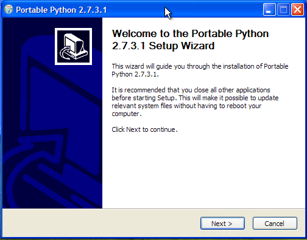

Klik butang *next* dan anda seharusnya mendapat skrin berikut:-

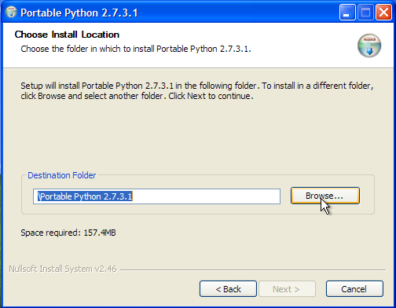

Klik butang *browse* untuk memilih lokasi *folder* untuk pemasangan. Saya cadangkan
anda *install* aplikasi ini di folder `C:\\Python`. Berikut cekupan skrin untuk step
ini:-

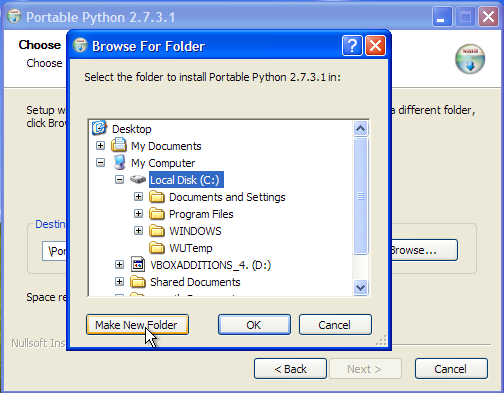

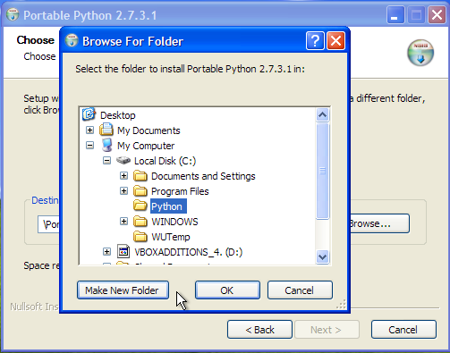

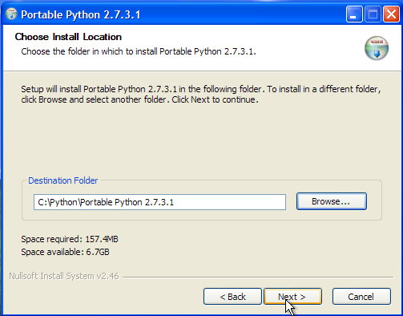

Setelah menetapkan lokasi *folder*, langkah berikutnya adalah untuk memilih *libraries* untuk dimasukkan sekali dalam pemasangan ini. Sila pastikan Django dipilih:-

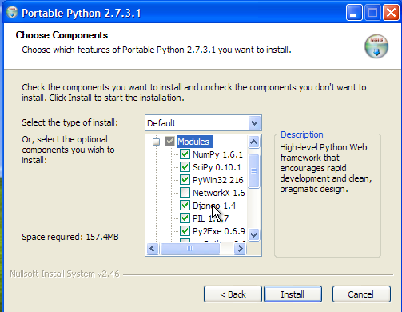

Langkah terakhir adalah dengan menekan butang *Install* bagi memulakan proses instalasi. Anda akan melihat skrin berikut dipaparkan:-

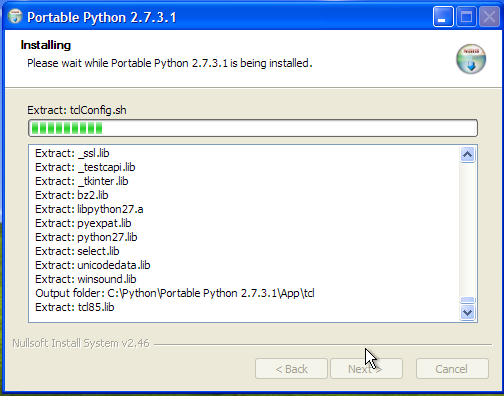

Proses instalasi akhirnya tamat.

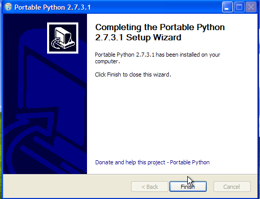

==============
Cuba Instalasi
==============
Sekarang mari kita pastikan proses instalasi berjalan dengan lancar dan kita
mendapat pakej Python_ yang diperlukan. Navigasi ke dalam ``My Computer`` anda
ke lokasi berikut - ``C:\Python\Portable Python 2.7.3.1``. Pastikan *folder*
tersebut mempunyai folder dan fail-fail seperti dalam cekupan skrin di bawah:- 

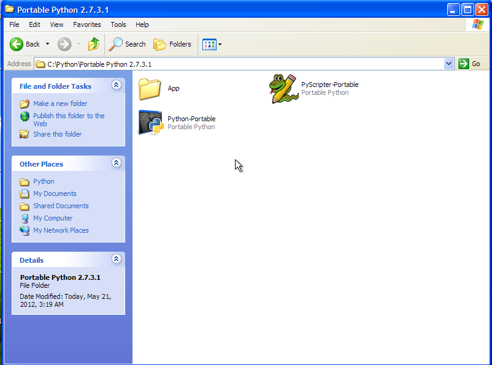

Klik dua kali pada fail ``Portable-Python`` untuk melancarkannya dan anda akan
mendapat skrin konsol Python.

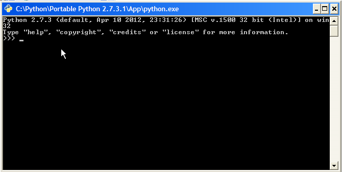

Taip kod berikut dalam konsol berkenaan::

    >>> import django
    >>> django

Anda akan mendapat output seperti berikut::

    <module 'django' from 'C:\Python\Portable Python 2.7.3.1\App\lib\site-packages\django\__init__.pyc'>

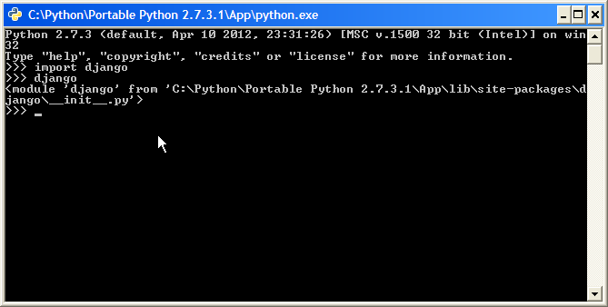

Tahniah ! Ini menunjukkan anda telah berjaya meng'*install*' sistem Python ke dalam komputer anda. Anda sekarang sudah bersedia untuk mula mempelajari Django.

.. _Django: http://www.djangoproject.org/
.. _Python: http://www.python.org/
.. _PortablePython: http://www.portablepython.com/
.. _Notepad++: http://notepad-plus-plus.org/
